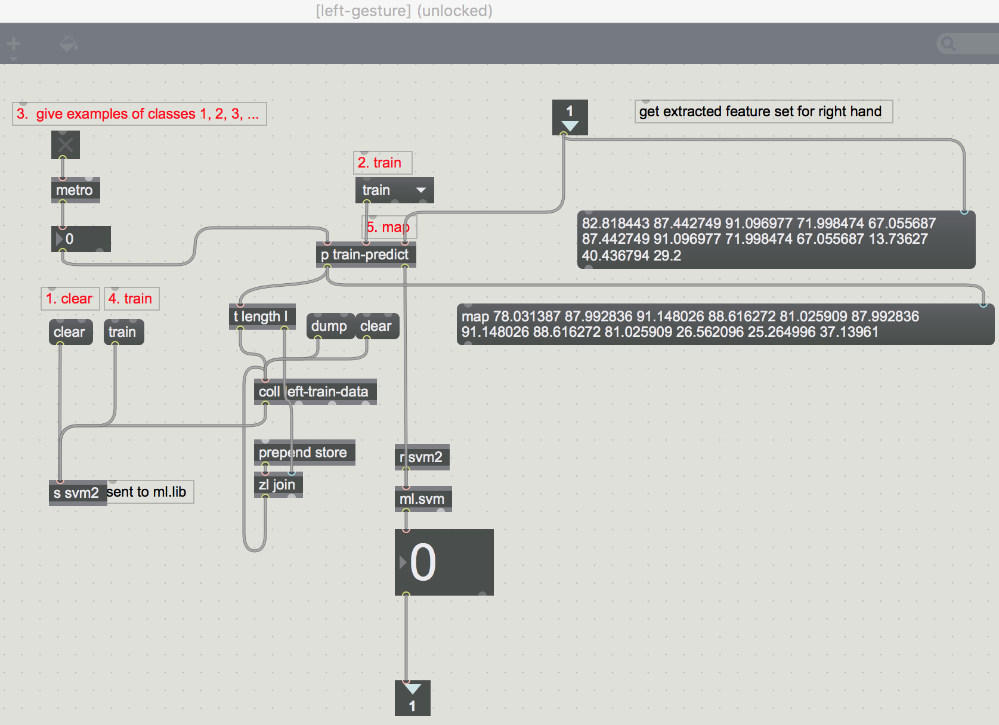

**What do we have so far?**

We have a basic theremin device that works robustly calculating palm distances to control pitch and volume on each hand. However, the device is very limiting as note transitions and accuracy are very difficult to master on the instrument. We could make it better by adding simple note visualizations but the sound of the device never changes. What can be done to shape the sound much like a synthesizer? 

I tried emulating the basic functionality of wave shape forming with gestures on a theremin. This post (*long one*) gives a detailed rundown of my max patch “GestureWaveTheremin”. The instrument is a live synthesizer that generates and shapes wave forms while the user is playing the theremin. The instrument allows the player to control the volume of a specific waveform by selecting a gesture. 

The max patch has a similar structure as the previous patch. Leap Motion sends palm distances for volume and pitch. However, we used a gesture recognition patch to select a specific gesture or wave form and manipulate the amplitude of that waveform. (***Will be explained in detail***)

# **Gesture Recognition using Machine Learning**
The problem of teaching a system to recognize gestures can be solved with multiple approaches. This problem is a classification problem. Depending on the complexity of the problem, the solution can be chosen. If the classification involves simple finger count or a fist/ palm detection, computer vision algorithms that process matrix data (OpenCv, Matlab) are powerful enough to solve the problem. However, we eventually want to classify complex gestures and have the artist map creative gestures for various parameters. For this purpose, Machine Learning is a powerful and efficient tool.

*The fact that we can add gestures and change the way an instrument behaves adds an artistic choice to the musician.*

## **Patching Time**

The patch looks complicated but is simple in functioning. Pitch generated from the "pitch-gen" subpatch is visualized as a MIDI note and sent into 4 waveform oscillators. These 4 oscillators will genereate 4 waves and merge the ways to together. The waves generated are modulated with a classic Low Frequency Oscillator. The wave forms have a gain slider that controls and mixes the amount of each wave. These 4 sliders are controlled with the left hand. 4 hand gestures will be used to control the amplitude of each wave being mixed. The open palm will control the overall gain of the system (***right bottom corner***). The hand gestures are classified using the machine learning model patch "p left-gesture"

The generated waves are further mixed with a noise generator (VCO1 which feeds in white noise or pink noise).

## Max Patch: Basic Theremin: [git](https://github.com/sandcobainer/gesturalmusicinterfaces/tree/master/theremingesture/older-v) 
The max patch for this tutorial is named basictheremin.maxpat. I tried to keep this patch as simple as possible, the patch will open in “Presentation Mode” in Max. However to edit the patch, you’ll have unlock the patch and get into “Patching mode” (*all the modes are displayed at the bottom left corner)* .

This patch uses the **palmposition** object from the leapmotion external to calculate distance of the hand. The palmposition is the big red dot in the screenshot above. Following this, the right hand will be mapped to pitch or frequency of a sound wave and the left hand will be mapped amplitude of the sound wave. 

**Mapping** : The vertical distances of the right hand from the leapmotion are mapped to frequencies between 130Hz - 4700Hz using the ‘zmap’ object in Max. The vertical distance of the left hand is mapped to a volume slider between 0 - 127.

However the numbers alone do not generate the sound and we will need a sound generator or an oscillator. We will choose a basic sinusoidal oscillator. A simple delay effect (*tapin delay*), an audio meter, a dac~ and spectro graph to observe the waves are added and bundled into a small usable plugin in presentation mode. 

The next post will explore other data from Leap Motion, machine learning, advanced designs and limitations of this approach.
